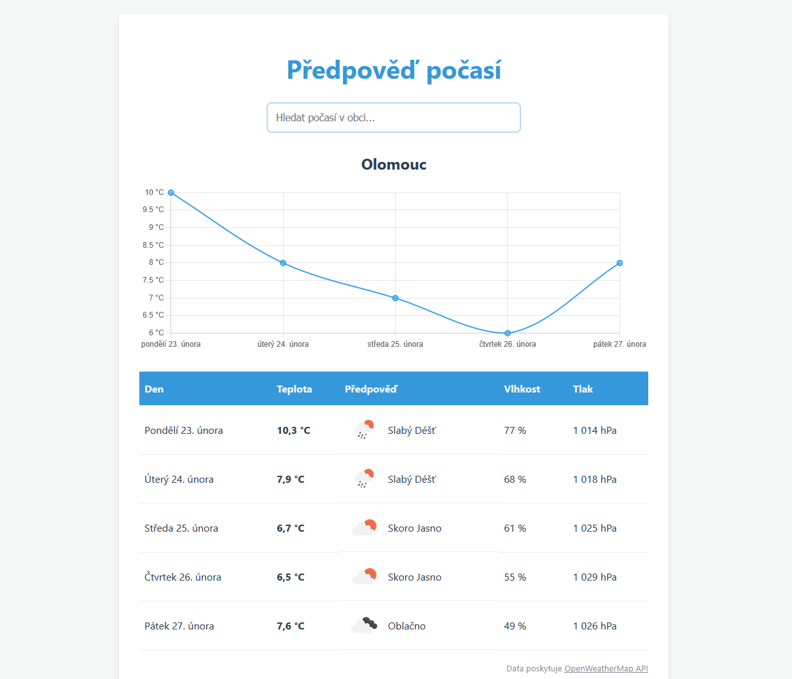

# WeatherApp – Předpověď počasí



Jednoduchá webová aplikace pro zobrazení 5denní předpovědi počasí s využitím OpenWeatherMap API.

## Spuštění projektu

Projekt využívá nástroj Vite pro vývoj a build TypeScript/SASS aplikace.

### Instalace závislostí

```bash
npm install
```

### Konfigurace API klíče

Vytvoř soubor `.env` v kořenové složce projektu:

VITE_OPENWEATHER_KEY=tvuj_api_klic

API klíč lze zdarma získat na https://openweathermap.org/

### Spuštění vývojového serveru

```bash
npm run dev
```

### Produkční build

```bash
npm run build
```

## Použité technologie

- TypeScript – typová bezpečnost a strukturované zpracování dat z REST API
- SASS (SCSS) – modulární stylování
- Vite – build nástroj
- Chart.js – vizualizace teplotního grafu (bonusová funkcionalita)
- HTML5 / Vanilla JavaScript

## Architektura

Projekt je navržen s důrazem na jednoduchost a čitelnost.

Aplikace využívá funkcionální přístup:
- data jsou imutabilní
- UI je čistou funkcí stavu
- změna stavu vyvolá překreslení UI

## Struktura projektu

src/

- main.ts – Centrální orchestrátor aplikace
- state.ts – Správa aplikačního stavu
- types.ts – Definice datových typů

src/components/

- Search.ts – Dynamický autocomplete (datalist)
- Forecast.ts – Generování tabulky a chybových hlášení
- ForecastChart.ts – Graf teploty (Chart.js)

src/services/

- api.ts – Komunikace s OpenWeatherMap API
- formatter.ts – Lokalizace a formátování pomocí Intl API

src/styles/

- main.scss – hlavní vstupní styl aplikace
- _theme.scss – proměnné a tematické nastavení

src/data/

- Statický JSON dataset měst České republiky

## Podporované prohlížeče

Aplikace je testována na aktuálních verzích:
- Google Chrome
- Mozilla Firefox
- Microsoft Edge

Formátování data a času se přizpůsobuje navigator.language.

## Použité zdroje

OpenWeatherMap API – https://openweathermap.org/
Favicon – https://www.flaticon.com
Favicon generator – https://favicon.io